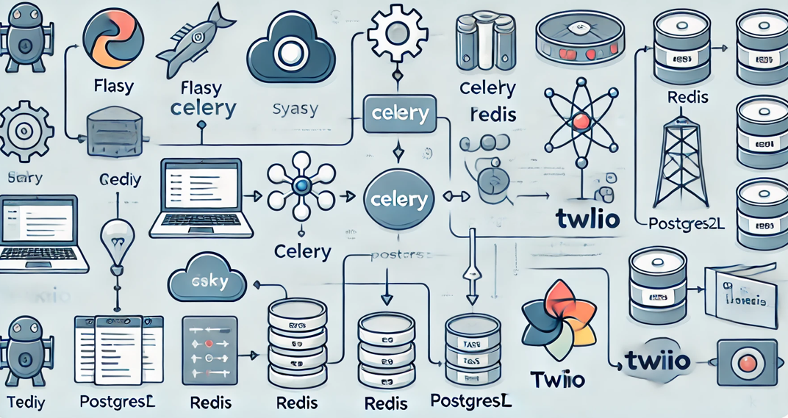
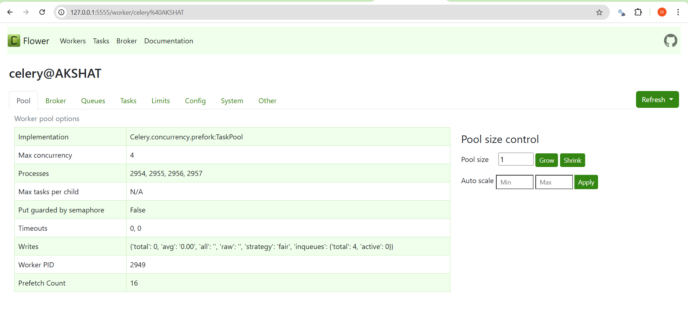
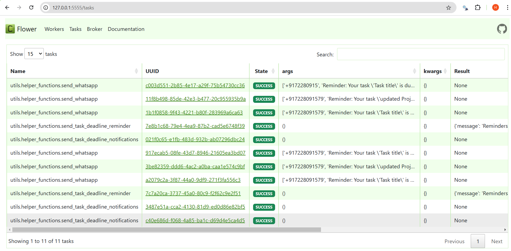

# Notification System for Task Deadlines



This system is built using Flask, Celery, Redis, PostgreSQL, and Twilio. It is designed to manage user tasks, send notifications (via SMS and WhatsApp) for approaching task deadlines, and provide users with scheduled reminders.

## Key Features:

- **Task Management**: Allows users to create, track, and manage tasks.
- **Asynchronous Task Processing**: **Celery** is used to handle background task execution for improved performance.
- **Notifications**: Sends notifications (SMS and WhatsApp) to users about task deadlines using **Twilio**.
- **Bulk Notifications**: Supports sending bulk notifications that allowing efficient mass communication.
- **Scheduled Reminders**: Reminds users about their tasks on a predefined schedule using **cron jobs**.
- **Message Broker**: **Redis** is used as a message broker to facilitate communication between the components.
- **Database**: **PostgreSQL** is used to store user and task data.


## Setup Instructions

### 1. Add the `.env` File
Create a `.env` file in the root directory and add the following configuration:

#### Redis Configuration
```
REDIS_PASSWORD=<your-radis-password>
REDIS_HOST=<redis-host>
REDIS_PORT=<redis-port>
REDIS_DB=0
```

#### PostgreSQL Configuration
```
POSTGRES_USER=<postgres-username>
POSTGRES_PASSWORD=<your-postgres-password>
POSTGRES_HOST=<your-postgres-host>
POSTGRES_PORT=<postgres-port>
POSTGRES_DB=<your-db-name>
```

#### Twilio Configuration
```
TWILIO_ACCOUNT_SID=<your-account-sid>
TWILIO_AUTH_TOKEN=<your-auth-token>
TWILIO_PHONE_NUMBER=<sms-number>
TWILIO_WHATSAPP_NUMBER=<whatsapp-number>
```

### 2. Create a Virtual Environment and Install Requirements
1. Create a virtual environment:
   ```bash
   python3 -m venv venv
   ```

2. Activate the virtual environment:
   - On Linux/macOS:
     ```bash
     source venv/bin/activate
     ```
   - On Windows:
     ```bash
     venv\Scripts\activate
     ```

3. Install all required libraries from `requirements.txt`:
   ```bash
   pip install -r requirements.txt
   ```

### 3. Run the Flask Application
In the first terminal, run the Flask application:
```bash
python3 run.py
```


### 4. Start the Celery Worker
In the second terminal, start the Celery worker with the following command:
```bash
celery -A celery_worker.celery worker --concurrency=4 -l info
```

### 5. Start the Celery Beat Scheduler
In the third terminal, start the Celery beat scheduler to run periodic tasks:
```bash
celery -A app.celery beat --loglevel=info
```

### 6. Start Celery Flower
In the fourth terminal, run Flower to monitor Celery tasks:
```bash
celery -A celery_worker.celery flower
```

This will provide a web-based monitoring tool where you can track task failures, retries, successes, and worker activity.

## System Architecture

The system leverages several powerful tools to handle background tasks, scheduling, and monitoring:

1. **Celery for Asynchronous Task Processing**:  
   Celery is used to manage background tasks asynchronously. This ensures that tasks such as sending notifications and reminders are processed without delaying the main application, leading to better performance and scalability.

2. **Celery-Beat for Scheduling Frequent Tasks**:  
   **Celery-Beat** is utilized for scheduling recurring tasks, such as periodic reminders and notifications. It enables tasks to be executed at regular intervals (e.g., hourly or daily), automating the process of sending updates to users.

3. **Flower for Task Monitoring**:  
   **Flower** provides real-time monitoring of Celery tasks. It offers a web-based interface where you can track the status of tasks, worker performance, and any failures, making it easier to manage and troubleshoot background operations.

These components work together to ensure efficient task execution, reliable scheduling, and effective monitoring in the system.

## PostMan Collection

[text](<c:/Users/Admin/Downloads/Notification System.postman_collection.json>)

## Notes
- Ensure that Redis and PostgreSQL are properly set up and running before starting the application.
- Keep the `.env` file secure as it contains sensitive credentials.
- Use a virtual environment to manage dependencies and avoid conflicts with global Python packages.

## Monitoring
Use Flower to monitor the status of Celery tasks and workers:
- Access Flower at `http://localhost:5555` (default port).







